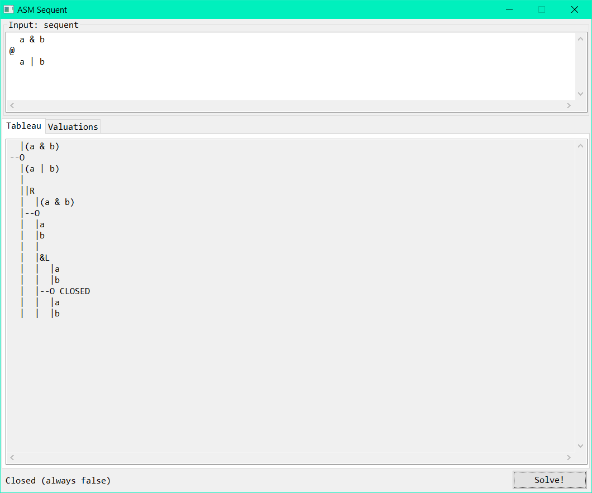
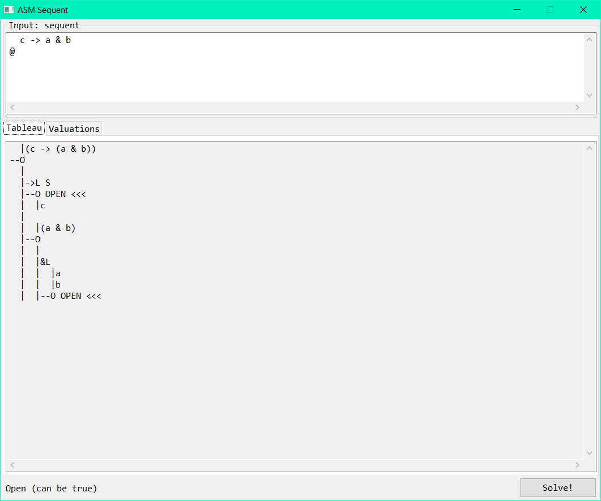
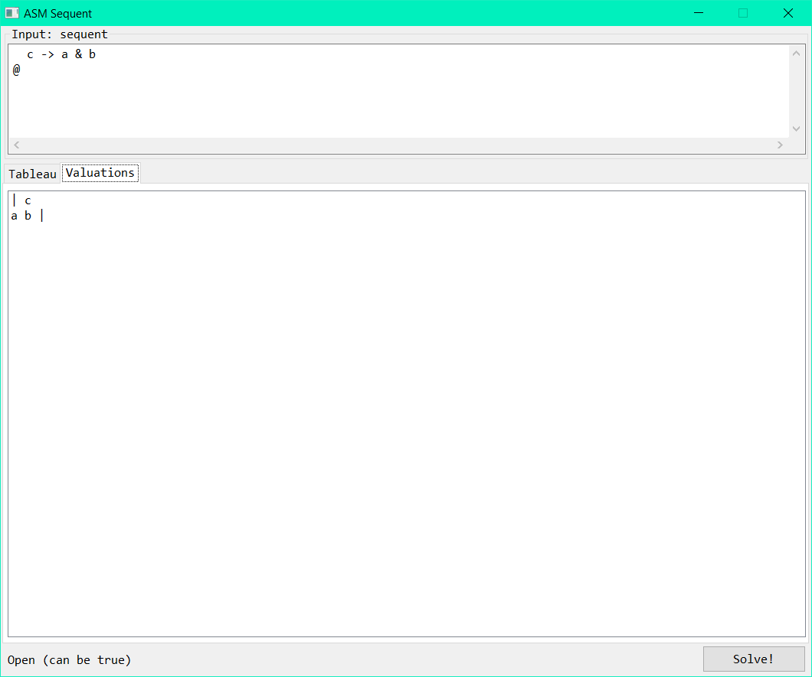

Assembly sequent solver GUI
===========================

Solves a [sequent](https://en.wikipedia.org/wiki/Sequent) you enter by [applying rules](https://en.wikipedia.org/wiki/Sequent_calculus) and displays the resulting [tableau](https://en.wikipedia.org/wiki/Method_of_analytic_tableaux).
A sequent is open if the propositional formula to the left of the `@` can be true while simultaneously the formula on the right is false, in this case the program displays the list of possible valuations with true variables to the left of a bar (`|`) and false variables to the right (the valuations may include duplicates). A sequent is closed if this is not satisfiable.
Hence, you can use `φ @` for some propositional formula `φ` to check if `φ` is satisfiable, and you can use `@ φ` to check if the negation is unsatisfiable to check if `φ` is always true.

This is just a program I made for fun during a course in 2018 (my first large assembly program).
It's not (made to be) particularly efficient, since it allocates all terms on the heap to display the tableau later. Most of the running time is actually spent on concatenating strings to display it. However, it should work correctly, be crash-free (if it has enough memory), and not have memory leaks. Although it doesn't always check if Windows/MSVC functions it calls return success.

This was written for [flat assembler](https://flatassembler.net/) 1. Point the `inc` environment variable to the fasm `INCLUDE` directory when building. You can also open the `.fpr` project file with the [Fresh IDE](https://fresh.flatassembler.net/). In Fresh, you can set `inc` as an 'alias' via the IDE/project options.

It works on x86-64 Windows and on Linux with Wine.

The assembly files in the initial commit are the original ones from 2018, so they still contain some TODOs for stuff that could be done and some commented/unused legacy code.

Credit me with a [link to the repository](https://github.com/stevenwdv/asmsequent) if you use this somewhere for some reason!

Screenshots
-----------

`a & b` cannot be true while `a | b` is false.

`c -> a & b` is true if either `c` is false or `a` and `b` are both true.
